<h1 align="center">Atacadão Best Price</h1>

<p align="center">
  <b>Comparador de preços de mercado para o Atacadão: preço de atacado por filial, promoções, lista de compras inteligente e análise da nota fiscal.</b>
</p>

<p align="center">
  
</p>

---

[](https://nextjs.org/)
[](https://react.dev/)
[](https://www.typescriptlang.org/)
[](https://tailwindcss.com/)
[](https://nodejs.org/)
[](https://atacadao-best-price.vercel.app)
[](LICENSE)
[](#funcionalidades)

🔗 **Demo online:** [https://atacadao-best-price.vercel.app](https://atacadao-best-price.vercel.app)

 **compras de mercado e de supermercado**, construído sobre as APIs públicas da loja online do Atacadão. Ele mostra o **preço real por filial e por quantidade**, destaca o **preço de atacado** (quanto mais leva, menos paga por unidade), sugere alternativas mais baratas, monta **listas de compras** com o total exato e compara o que você **previu com o que pagou** usando a **NFC-e** da compra.

> ⚠️ Projeto independente e **não oficial**, sem vínculo com o Atacadão. Veja o [aviso legal](#aviso-legal).

> 🇺🇸 **English:** unofficial supermarket price-comparison web app for [Atacadão](https://www.atacadao.com.br) (Brazil's wholesale cash-and-carry chain). It reads the store's public VTEX/FastStore APIs to show real per-branch prices, wholesale tier pricing (buy more, pay less per unit), promotions, smart shopping lists, a barcode/QR scanner and NFC-e receipt analysis (planned vs. paid). Built with Next.js 16, React 19, TypeScript and Tailwind CSS 4.

Ir para:
- [**Funcionalidades**](#funcionalidades)
- [**Capturas de tela**](#capturas-de-tela)
- [**Como funciona**](#como-funciona)
- [**Requisitos**](#requisitos)
- [**Instalação**](#instalação)
- [**Começando**](#começando)
- [**Configuração**](#configuração)
- [**SEO e compartilhamento**](#seo-e-compartilhamento)
- [**Testar no celular**](#testar-no-celular)
- [**Deploy na Vercel**](#deploy-na-vercel)
- [**Estrutura do projeto**](#estrutura-do-projeto)
- [**Rotas de API do app**](#rotas-de-api-do-app)
- [**Dados e privacidade**](#dados-e-privacidade)
- [**Scripts**](#scripts)
- [**Aviso legal**](#aviso-legal)
- [**Licença**](#licença)
- [**Autor**](#autor)

---

## **Funcionalidades**

| Área | O que faz |
| --- | --- |
| **Início** | Mais vendidos da sua filial, atalhos para os departamentos e as maiores economias por quantidade. |
| **Busca e categorias** | Busca por nome ou código de barras, filtros por categoria, marca e faixa de preço, ordenação e **scroll infinito** (o catálogo carrega sozinho, sem clicar). |
| **Promoções** | Coleções de oferta descobertas no próprio site, ordenação por desconto, economia e "falta pouco" para o próximo degrau, com filtros por departamento e quantidade. |
| **Scanner** | Lê **QR code e código de barras** pela câmera (ou de uma imagem), mostra o produto e sugere **semelhantes de outras marcas mais baratos**, com % e R$ de diferença. |
| **Lista de compras** | Preço real de cada item **na quantidade escolhida**, desconto de atacado, total com e sem desconto, seções por departamento e **modo checklist** (o que já foi comprado, com preço informado para itens fora do catálogo online). |
| **Montar lista** | Digite o item e a quantidade: o app pergunta só o que faz diferença (ex.: qual corte de frango), mostra as melhores opções e avisa quando **falta 1 unidade** para um preço menor. |
| **Sugestões de lista** | Lista completa da "compra do mês" e temas da própria loja (café da manhã, festas…), com quantidade por pessoas, itens removíveis e melhores promoções para cada um. |
| **Nota fiscal (NFC-e)** | Lê o QR da nota, importa os itens para a lista e compara o que foi pago com o preço de hoje (notas de **MS**, SEFAZ-MS). |
| **Compras salvas** | Salve a lista na sua conta, anexe a NFC-e ao finalizar e veja o **acerto**: previsto × pago, o que veio de diferença (preço, quantidade, itens fora do plano). |
| **Conta** | Login real do Atacadão por **código enviado ao e-mail**, dados pessoais, pedidos recentes, favoritos e configurações. |
| **Configurações** | Filial (por localização ou CEP), comparação entre filiais ou interna e modelo de compra (atacado ou unitário). |

## **Capturas de tela**

<table>
  <tr>
    <td align="center">
      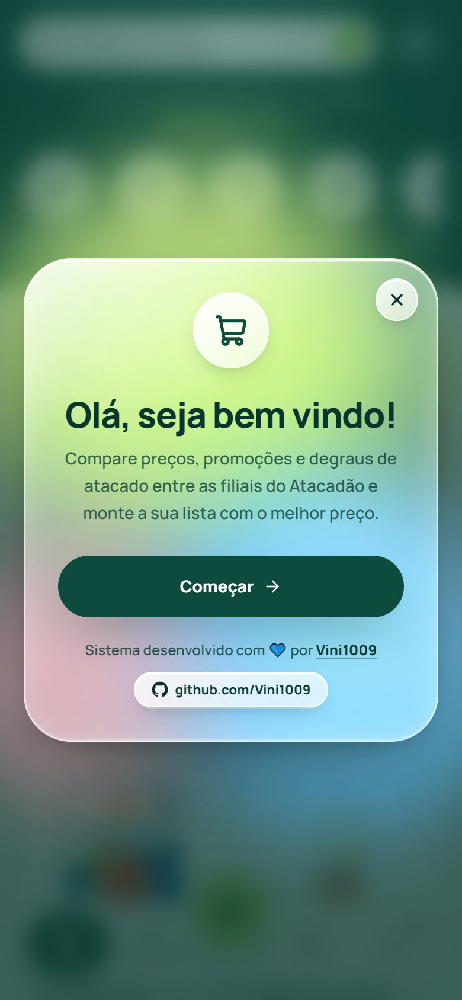<br>
      <sub><b>Boas-vindas</b></sub>
    </td>
    <td align="center">
      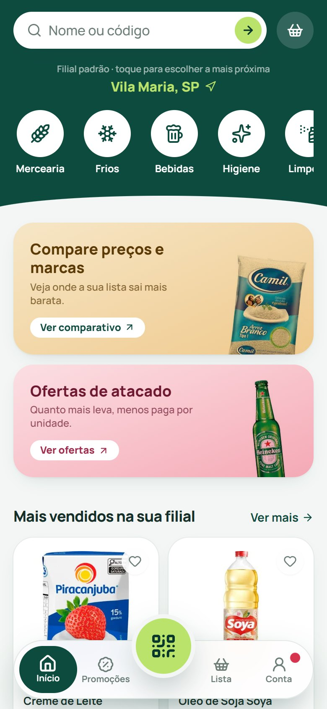<br>
      <sub><b>Início</b></sub>
    </td>
    <td align="center">
      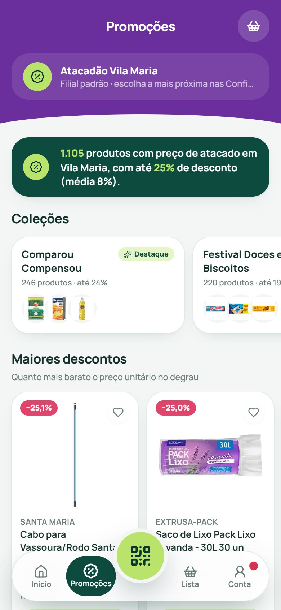<br>
      <sub><b>Promoções</b></sub>
    </td>
  </tr>
  <tr>
    <td align="center">
      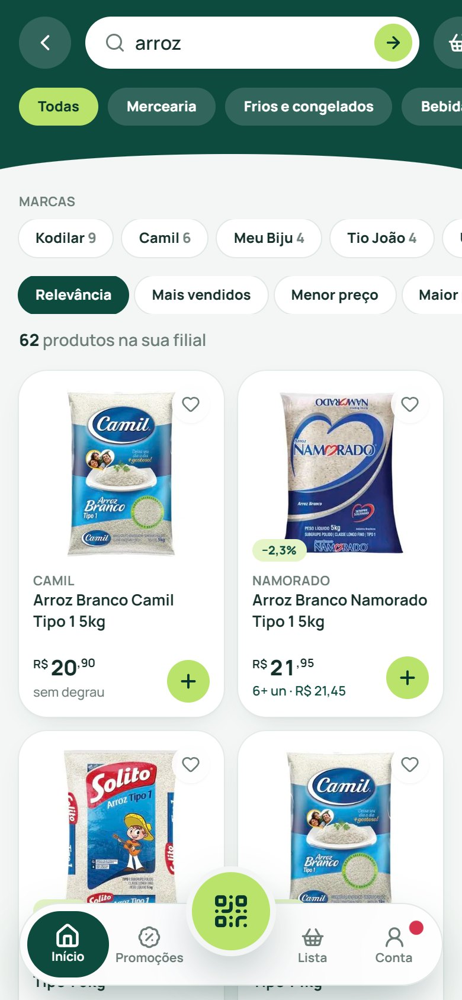<br>
      <sub><b>Busca com filtros</b></sub>
    </td>
    <td align="center">
      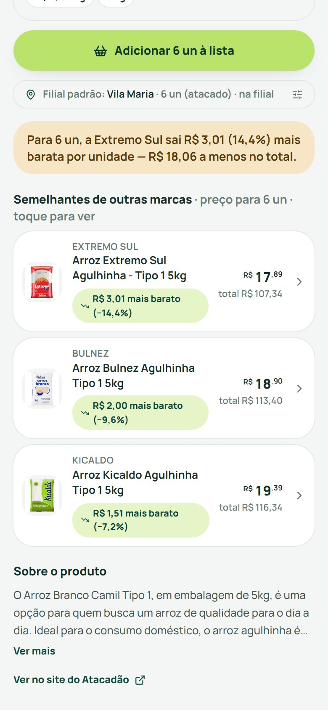<br>
      <sub><b>Semelhantes mais baratos</b></sub>
    </td>
    <td align="center">
      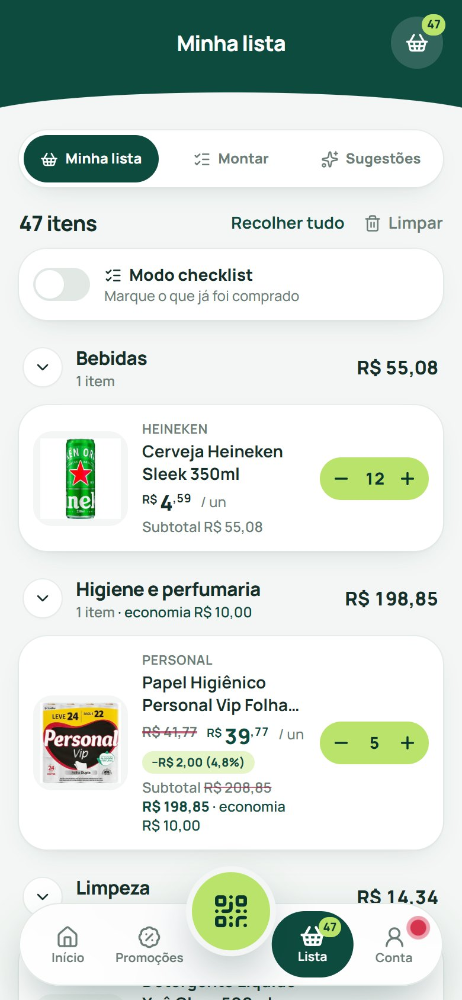<br>
      <sub><b>Minha lista</b></sub>
    </td>
  </tr>
  <tr>
    <td align="center">
      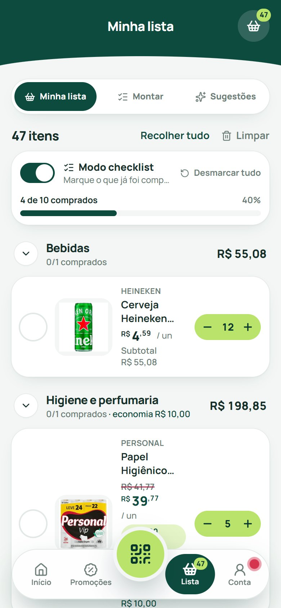<br>
      <sub><b>Modo checklist</b></sub>
    </td>
    <td align="center">
      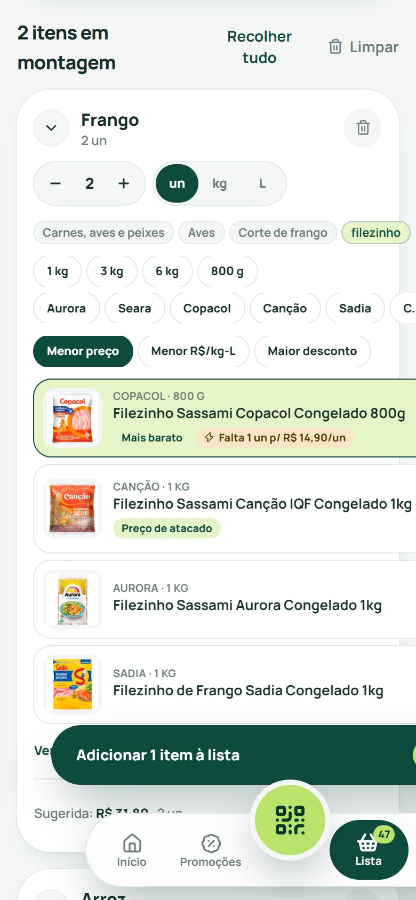<br>
      <sub><b>Montar lista</b></sub>
    </td>
    <td align="center">
      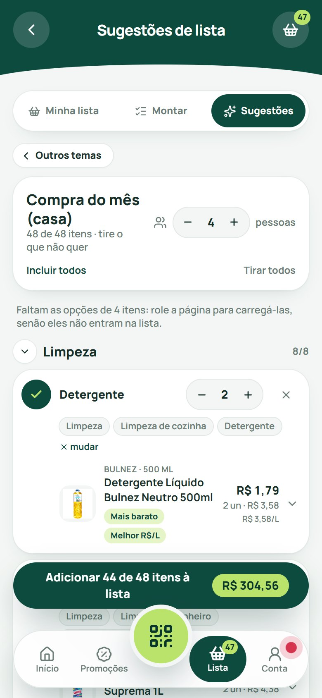<br>
      <sub><b>Sugestões de lista</b></sub>
    </td>
  </tr>
  <tr>
    <td align="center">
      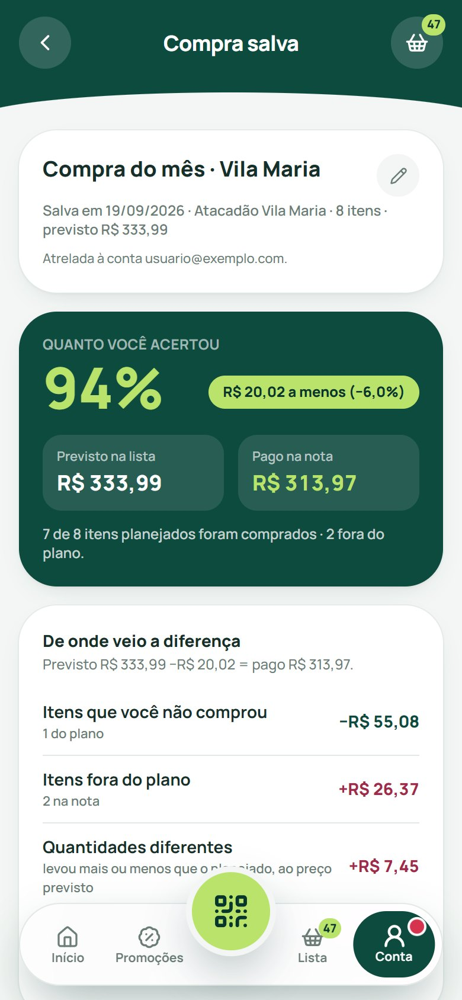<br>
      <sub><b>Previsto × pago</b></sub>
    </td>
    <td align="center">
      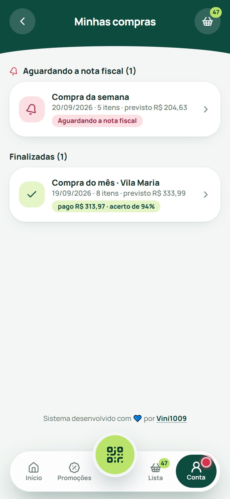<br>
      <sub><b>Minhas compras</b></sub>
    </td>
    <td align="center">
      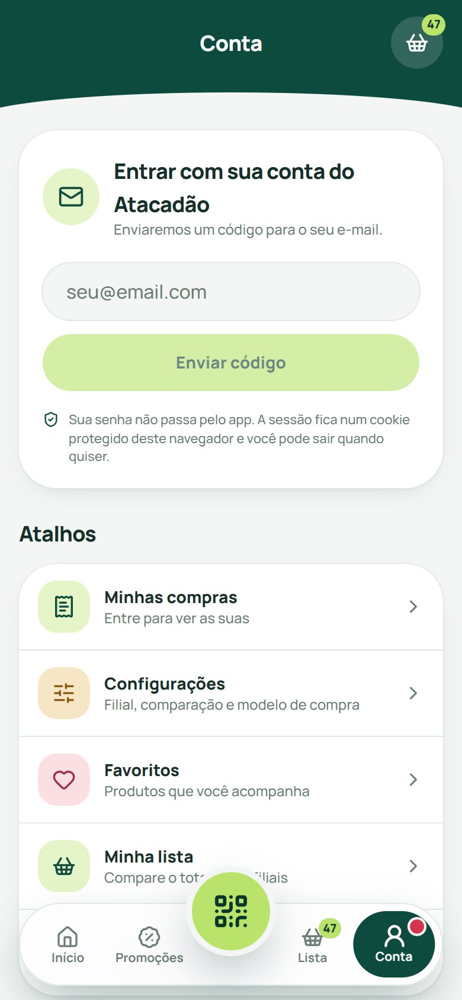<br>
      <sub><b>Conta</b></sub>
    </td>
  </tr>
</table>

> As capturas usam preços reais consultados no Atacadão (filial Vila Maria) e dados de demonstração nas telas de compras salvas e da conta.

## **Como funciona**

O Atacadão roda em **VTEX**. O app conversa com as camadas que o próprio site usa, sempre por filial (`seller`) e com a quantidade real:

| Camada | Uso no app |
| --- | --- |
| GraphQL FastStore (`/api/graphql`) | Catálogo, busca, filtros e **degraus de atacado** (`offers.offers[].minQuantity`). |
| Catálogo legado VTEX | EAN, categorias, imagens e produtos por código. |
| Simulação de carrinho (`orderForms/simulation`) | Preço final por filial e quantidade (base do total da lista). |
| Busca inteligente | Sugestões de termos e buscas populares. |
| Pontos de retirada / regiões | Filial mais próxima por localização ou CEP. |
| VTEX ID | Login por código de e-mail. |

**Nada é fixo no código:** departamentos, coleções de promoção, temas de sugestão e perguntas de refinamento saem dos dados da API. Se a loja criar uma categoria ou coleção nova, ela aparece no app sozinha.

## **Requisitos**
* Node.js >= 20.9
* npm (ou outro gerenciador compatível)
* Conexão com a internet (o app consulta o site do Atacadão)

## **Instalação**
Clone este repositório e instale as dependências:
```
git clone https://github.com/bvdistribuidoradesuprimentos-byte/distribuidora.git
cd atacadao-best-price
npm install
```

## **Começando**

Não há variáveis de ambiente nem chaves de API: tudo usa endpoints públicos do site.

Para rodar em desenvolvimento:
```
npm run dev
```
Abra [http://localhost:3000](http://localhost:3000).

Para gerar a versão de produção e servi-la:
```
npm run build
npm run start
```

Por padrão o app usa a filial Vila Maria (São Paulo). Para trocar, vá em **Conta > Configurações** e use sua localização (com permissão do navegador) ou um CEP.

## **Configuração**

As preferências ficam no navegador (**Conta > Configurações**):

| Opção | Valores | O que muda |
| --- | --- | --- |
| Filial | Por localização ou CEP | Preços, estoque e degraus de atacado variam por filial. |
| Comparação | Entre filiais / Interna | Compara o total da lista nas filiais próximas ou só produtos semelhantes na sua filial. |
| Modelo de compra | Atacado / Unitário | Define a quantidade usada nas comparações (o degrau de atacado entra sozinho quando atingido). |

## **SEO e compartilhamento**

O site já sai pronto para buscadores e para links compartilhados (WhatsApp, LinkedIn, X):

- **Metadados** em pt-BR (	itle, description, palavras-chave como *comparador de preços de mercado*, *lista de compras de mercado* e *preço de atacado*), Open Graph e Twitter Card com imagem 1200×630.
- **Dados estruturados** (schema.org/WebApplication) no HTML de todas as páginas.
- **/sitemap.xml dinâmico:** páginas fixas + um endereço por departamento, lidos da própria loja (acompanha o que ela criar ou tirar).
- **/robots.txt:** libera o site e bloqueia telas pessoais (/conta, /lista, /scan) e /api/.
- **/manifest.webmanifest** e ícone (pp/icon.svg) para instalar o site na tela inicial do celular.

Ao publicar, defina o endereço do site para que sitemap, canonical e Open Graph usem a URL correta:
```
NEXT_PUBLIC_SITE_URL=https://seu-dominio.com.br
```

## **Testar no celular**

O `next dev` só aceita abrir o app por origens permitidas. Em `next.config.ts`, a opção `allowedDevOrigins` já libera `127.0.0.1` e túneis `*.trycloudflare.com`. Para testar pelo IP da sua rede local, informe o IP do seu computador na variável `DEV_ORIGINS` (vários, separados por vírgula), num arquivo `.env.local` que não vai para o Git:

```
DEV_ORIGINS=192.168.0.10
```

O leitor de QR/código de barras precisa de **HTTPS** para usar a câmera no celular. Um túnel resolve sem configuração:
```
cloudflared tunnel --url http://localhost:3000
```

## **Deploy na Vercel**

O projeto roda na Vercel sem configuração extra: o `vercel.json` fixa a região **São Paulo (`gru1`)**, perto do site do Atacadão e da SEFAZ. Passos:

1. Importe o repositório em [vercel.com/new](https://vercel.com/new) (ou use `npx vercel`).
2. Defina `NEXT_PUBLIC_SITE_URL` com o endereço do site (usado no sitemap, canonical e Open Graph).
3. Faça o deploy. Não há chaves nem segredos para configurar.

## **Estrutura do projeto**

```
app/
├── (tabs)/            Telas com navegação flutuante
│   ├── page.tsx       Início
│   ├── buscar/        Busca com filtros e scroll infinito
│   ├── categorias/    Departamentos (vindos da API)
│   ├── promocoes/     Promoções e degraus de atacado
│   ├── lista/         Minha lista, Montar e Sugestões
│   └── conta/         Perfil, configurações e compras salvas
├── api/               Rotas do servidor (proxy das APIs do Atacadão)
├── produto/[id]/      Página do produto
└── scan/              Scanner de QR code e código de barras
components/            Componentes de interface
docs/screenshots/    Capturas de tela usadas neste README
lib/                   Regras de negócio, stores e clientes das APIs
```

Destaques em `lib/`:

| Arquivo | Responsabilidade |
| --- | --- |
| `atacadao.ts` | Cliente das APIs do Atacadão (catálogo, simulação, filiais). |
| `deals.ts` | Cálculo de degraus de atacado e "falta N unidades". |
| `promos.ts`, `catalog-index.ts`, `taxonomy.ts` | Descoberta dinâmica de departamentos e coleções. |
| `suggest.ts`, `resolve.ts` | Sugestões de lista e perguntas de refinamento. |
| `receipt.ts`, `nfce.ts` | Leitura e validação da NFC-e. |
| `accuracy.ts` | Análise previsto × pago de uma compra salva. |
| `site.ts` | Metadados, palavras-chave e URL do site (SEO). |
| `vtex-auth.ts` | Login por código de e-mail (VTEX ID). |
| `scan-engine.ts` | Leitura de QR e código de barras (ZXing + `BarcodeDetector`). |

## **Rotas de API do app**

O navegador nunca fala direto com o Atacadão: as rotas abaixo fazem a consulta no servidor (e o `POST` só aceita requisições do próprio site).

| Rota | Método | Descrição |
| --- | --- | --- |
| `/api/catalog` | GET | Busca e listagem paginada (`after`) com filtros e ordenação. |
| `/api/catalog/prices` | GET | Preço e disponibilidade por filial. |
| `/api/promos` | GET | Coleções e listas de promoção (`view=overview\|list`). |
| `/api/suggest` | GET | Temas e listas de sugestão. |
| `/api/terms` | GET | Sugestões de busca e termos populares. |
| `/api/lookup` | GET | Produto por código de barras, com semelhantes mais baratos. |
| `/api/list/compare` | POST | Total real da lista por filial. |
| `/api/receipt` | POST | Leitura da NFC-e e comparação com os preços de hoje. |
| `/api/filiais/nearest` | GET | Filiais mais próximas por localização ou CEP. |
| `/api/filiais/receipt-store` | GET | Filial correspondente ao endereço de uma nota. |
| `/api/auth/send`, `/verify`, `/logout` | POST | Login por código de e-mail e saída. |

## **Dados e privacidade**

- **Sem banco de dados.** Lista, favoritos, preferências, rascunhos e **compras salvas** ficam no `localStorage` do seu navegador, separados por conta do Atacadão (e-mail). Trocar de aparelho ou limpar os dados do navegador apaga essas informações.
- **Login sem senha:** o app usa o código enviado por e-mail pelo próprio Atacadão. A sessão fica em um **cookie `httpOnly`**, inacessível ao JavaScript. Um cookie separado guarda só o e-mail da conta para o app saber de quem são as compras salvas.
- **Dados sensíveis** (CPF e telefone) chegam **mascarados** do servidor.
- **NFC-e:** o servidor só consulta domínios da SEFAZ com leitor implementado (hoje, **MS**) e nunca um endereço arbitrário vindo do QR. A URL da nota trafega por `POST` para não aparecer em logs de acesso.

## **Scripts**

| Comando | O que faz |
| --- | --- |
| `npm run dev` | Servidor de desenvolvimento. |
| `npm run build` | Build de produção. |
| `npm run start` | Serve o build de produção. |
| `npm run lint` | Análise estática (ESLint). |

## **Aviso legal**

Este é um projeto **independente**, feito por um consumidor, sem afiliação, patrocínio ou aprovação do Atacadão ou do Grupo Carrefour. Ele usa endpoints **públicos e não documentados** do site, que podem mudar ou deixar de funcionar sem aviso. Os preços exibidos são consultados na hora e **podem mudar até a compra**; a finalização da compra acontece sempre no site oficial do Atacadão. Nomes e marcas pertencem aos respectivos donos.

## **Licença**

[MIT](LICENSE) © 2026 [Distribuidora](https://github.com/bvdistribuidoradesuprimentos-byte/distribuidora).

## **Autor**

Sistema desenvolvido com 💙 por [**Distribuidora**](https://github.com/bvdistribuidoradesuprimentos-byte/distribuidora).
